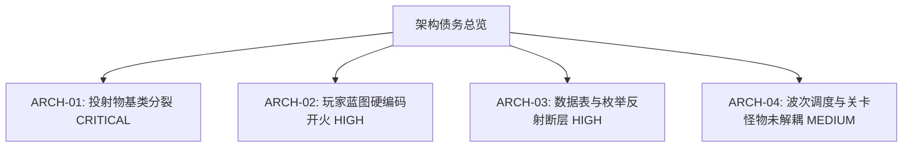

# 《GGBOM: 终末医疗兵》软件架构审计报告 (Architecture Audit)

> **审计执行阶段**：Phase 0 Takeover Audit  
> **审计对象**：UE5.8 纯蓝图工程 ([`xxxx/`](file:///Users/cc/Desktop/GGBOM/xxxx))  
> **技术基石**：UE5.8 Pure Blueprint + Paper2D / 2D Retro-Action Pixel Pipeline  
> **审计日期**：2026-09-03  

---

## 一、 系统架构总览与分类矩阵

本工程为纯蓝图（Pure Blueprint）架构的 2D 正交俯视角肉鸽射击游戏。经过深度审计，项目各主要运行时子系统的现状分类如下：

| 系统标识 | 系统名称 | 权威资产/蓝图路径 | 架构分类 | 稳定性评级 | 核心问题与风险 |
| :--- | :--- | :--- | :--- | :--- | :--- |
| `SYS.PLAYER_CONTROLLER` | 玩家移动与方向系统 | [`BP_Player_Medic.uasset`](file:///Users/cc/Desktop/GGBOM/xxxx/Content/Blueprints/Player/BP_Player_Medic.uasset) | **STABLE** | 高 | 经历了方向拓扑重构，三状态分离（MoveInput/FacingDirection/ShotDirection），单 Tick 流，运行稳定。 |
| `SYS.CAMERA_MANAGER` | 正交竖屏全景相机 | [`MAP_GGBOM_Main.umap`](file:///Users/cc/Desktop/GGBOM/xxxx/Content/GGBOM/Maps/MAP_GGBOM_Main.umap) | **STABLE** | 高 | OrthoWidth=941.0, AspectRatio=0.5628 锁定，与双层正交地图无缝吻合。 |
| `SYS.WEAPON_PROJECTILE` | 武器与投射物系统 | [`BP_Projectile_Base.uasset`](file:///Users/cc/Desktop/GGBOM/xxxx/Content/Blueprints/Projectiles/BP_Projectile_Base.uasset) | **NEEDS_REFACTOR** | 极高风险 | 存在 3 套不同时期的投射物基类，玩家蓝图中硬编码开火冷却与生成，缺乏策略模式。 |
| `SYS.ENEMY_AI` | 敌人状态机与 AI | [`BP_GGBOM_Enemy.uasset`](file:///Users/cc/Desktop/GGBOM/xxxx/Content/GGBOM/Blueprints/BP_GGBOM_Enemy.uasset) | **EVOLVING** | 中 | 基础移动/碰撞存在，但 4 向动画状态机、受击硬直反馈及猎犬/毒液特异 AI 尚未贯通。 |
| `SYS.STAGE_WAVE` | 波次管理与调度 | [`BP_StageWaveManager.uasset`](file:///Users/cc/Desktop/GGBOM/xxxx/Content/Blueprints/Stage/BP_StageWaveManager.uasset) | **NEEDS_REFACTOR** | 高 | 关卡目前依赖场景中静态放置的怪物 Actor，动态波次生成池未真正接管主游戏循环。 |
| `SYS.DEFENSE_PROPS` | 防御掩体与可破坏道具 | `DefenseLine_L/M/R` | **EVOLVING** | 中 | 场景中存在物理阻挡与血量判定，但完好/受损/破坏 3 态 Flipbook 切换未接入。 |
| `SYS.HEALTH_COMBAT` | 战斗结算与伤害判定 | [`BPC_Health.uasset`](file:///Users/cc/Desktop/GGBOM/xxxx/Content/GGBOM/Blueprints/Components/BPC_Health.uasset) | **EVOLVING** | 中 | 具有基础扣血，缺少全局 DamagePipeline、飘字、暴击与无敌帧策略。 |
| `SYS.UMG_HUD` | UMG 界面与战斗 HUD | [`WBP_GGBOM_CombatHUD.uasset`](file:///Users/cc/Desktop/GGBOM/xxxx/Content/GGBOM/UI/WBP_GGBOM_CombatHUD.uasset) | **NEEDS_REFACTOR** | 高 | 界面树已搭建，但数据绑定未完成，缺少独立 Mock ViewModel，无法离线预览。 |
| `SYS.CORE_DATA` | 核心数据表与枚举 | [`Blueprints/Core/Types/`](file:///Users/cc/Desktop/GGBOM/xxxx/Content/Blueprints/Core/Types) | **LEGACY** | 高 | 历史 Python 反射限制导致部分结构体/枚举未完全注入 DataTable，需规范化绑定。 |

---

## 二、 核心架构深入分析

### 1. 玩家移动与方向拓扑 (`SYS.PLAYER_CONTROLLER`) — `STABLE`
- **现状**：成功解决了历史迭代中 701 个臃肿节点、11 条重复 Tick 链的严重缺陷。
- **当前设计**：
  1. `MoveInput`：每 Tick 独立采样 WASD，松键立即归零；在 StandAlone 30FPS 下固定步长 7.5 uu（约 225 uu/s）。
  2. `FacingDirection`：仅在 `MoveInput` 非零时更新，松键时保持最后朝向，驱动 Flipbook 播放与水平翻转（`ScaleX = -1.0` 右 / `ScaleX = 1.0` 左）。
  3. `ShotDirection`：自动射击冷却满足并发射时，瞬时快照 `FacingDirection` 赋给子弹，子弹生成后自身沿直线飞行，不会因玩家转向而弯折。
- **保护守则**：已固化在 [`rebuild_direction_state_v2.py`](file:///Users/cc/Desktop/GGBOM/xxxx/Content/Python/rebuild_direction_state_v2.py)，严禁回退旧实现。

### 2. 武器与投射物系统 (`SYS.WEAPON_PROJECTILE`) — `NEEDS_REFACTOR`
- **代码异味 (Architecture Smells)**：
  - **多基类共存**：`BP_Projectile_Base` (Blueprints)、`BP_GGBOM_Projectile` (GGBOM)、`BP_Projectile_Bullet` (GGBOM) 三套体系并存。
  - **武器与 Pawn 强耦合**：开火逻辑直接写在玩家蓝图 `BP_Player_Medic` 的 EventGraph 中（硬编码 0.18s 自动步枪射击）。
  - **组件空壳化**：`BPC_WeaponInventory` 组件存在但未承载实际武器切换与弹药逻辑。
- **重构方向**：Phase 1 必须建立以策略模式（Strategy Pattern）为核心的统一 `BP_WeaponRuntime` 与 `BP_Projectile_Base`，实现零核心代码差别的武器增量扩展。

### 3. UI 架构与视图解耦 (`SYS.UMG_HUD`) — `NEEDS_REFACTOR`
- **历史问题**：此前场景中直接放置了 15 个世界空间 PaperSprite 组成的伪 HUD，导致与摄像机、角色深度冲突。
- **当前改善**：世界空间 HUD 已全部移至 `90_ARCHIVE_Legacy_WorldSpace_HUD` 并隐藏。建立了标准 UMG 蓝图控件：
  - `WBP_GGBOM_CombatHUD`（主战斗界面）
  - `WBP_HUD_WeaponSlot`（武器槽）
  - `WBP_HUD_TacticalSlot`（战术道具槽）
  - `WBP_HUD_ZoneTracker`（波次/区域追踪）
  - `WBP_Boss_OverheadHealthBar`（Boss 头顶血条）
- **待解决短板**：当前 UMG 控件未与实际数据源绑定（缺乏 Mock ViewModel 与 Event Dispatcher），无法在不运行游戏的前提下进行各状态的 UI 视觉走查。

---

## 三、 架构债务清单 (Architecture Debt)

1. **`ARCH-01 (CRITICAL)` 投射物基类分裂**：多个 `.uasset` 存在重复的碰撞与移动计算，必须在 Phase 1 统一。
2. **`ARCH-02 (HIGH)` 武器逻辑侵入 Pawn**：缺乏 `WeaponStrategy` 抽象，无法优雅支持散弹、激光、蓄力等不同武器类型。
3. **`ARCH-03 (HIGH)` 核心数据驱动断层**：数据未通过规范 DataTable 驱动，数值与资产散落在蓝图默认值中。
4. **`ARCH-04 (MEDIUM)` 波次生成器未接管游戏**：`BP_StageWaveManager` 未与关卡生成点、对象池和游戏胜负流挂接。

---

## 四、 结论与治理路线

1. **当前游戏可运行性**：当前工程通过 StandAlone Lite Runner（360x640 @ 30FPS）可顺畅运行，玩家移动、朝向、地图双层遮挡与基础射击 100% 正常。
2. **Phase 0 治理原则**：保持现状稳定，**不擅自重构或修改现有蓝图逻辑**。
3. **Phase 1 目标**：以武器系统为切入点，完成首个“纯蓝图高内聚架构 + 100% 视觉完备”的标杆系统。
