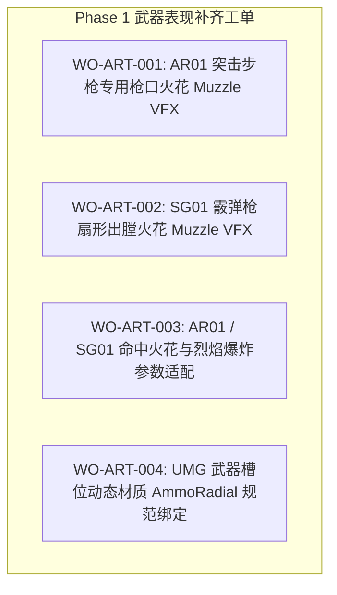

# 《GGBOM: 终末医疗兵》Phase 1 武器美术工单与表现补齐任务书 (Art Work Orders)

> **工单批次**：Phase 1A Art Resolution & Work Orders  
> **制定原则**：根据 Feature Contract、Art Registry 与武器依赖缺口，**自动计算并下发全量 Mandatory 补齐工单**。在工单审核通过并完成 Hash 锁定前，对应 Feature 严格保持 `BLOCKED_BY_ART` 状态。  
> **制定日期**：2026-09-03  

---

## 一、 Phase 1 核心武器工单列表

---

## 二、 工单详细规格说明

### 工单 1: `WO-ART-001` (AR01 突击步枪专用 Muzzle VFX)
- **目标特性**: `Weapon.AR01`
- **语义 Asset ID**: `VFX.WEAPON.AR01.MUZZLE`
- **规格要求**:
  - **形式**: 4 帧连续动画水平条带图（Sheet）或带 Alpha 的高精点射火花 Sprite。
  - **尺寸**: 像素尺寸 `128 × 128`，世界空间有效尺寸约 `32 × 32 uu`。
  - **轴心 (Pivot)**: 底部中心或枪口中心 `(X=0.5, Y=0.5)`。
  - **朝向**: 默认正向上方发射，跟随开火旋转向量 `MakeRotFromX` 旋转。
  - **临时复用方案**: 在专属定制完成前，可由 `VFX_Spark` (机械火花第 01 帧) 经过缩放配置作为候选。

---

### 工单 2: `WO-ART-002` (SG01 霰弹枪扇形出膛 Muzzle VFX)
- **目标特性**: `Weapon.SG01`
- **语义 Asset ID**: `VFX.WEAPON.SG01.MUZZLE`
- **规格要求**:
  - **形式**: 4 帧连续爆发条带图（Sheet），体现重型火药喷薄感。
  - **尺寸**: 像素尺寸 `256 × 128`，世界空间扩散跨度约 `48 × 32 uu`。
  - **轴心 (Pivot)**: 底部连接处 `(X=0.5, Y=0.90)`。
  - **临时复用方案**: 可复用 `/Game/P01/.../05_VFX/01_Flame` 烈焰喷射首帧作为候选。

---

### 工单 3: `WO-ART-003` (命中爆炸 Impact VFX 参数适配)
- **目标特性**: `Weapon.AR01`, `Weapon.SG01`, `Weapon.KineticPistol`
- **语义 Asset ID**: `VFX.WEAPON.AR01.IMPACT`, `VFX.WEAPON.SG01.IMPACT`
- **规格要求**:
  - AR01 命中：挂载 `VFX_Spark` 4 帧 Flipbook（缩放 `0.35`，持续 `0.12s`）。
  - SG01 命中：挂载 `VFX_Flame` 4 帧 Flipbook（缩放 `0.50`，持续 `0.18s`）。
  - 在受击点精确触发受击材质闪白（Flash White）微动画。

---

### 工单 4: `WO-ART-004` (UMG 武器槽位与弹药圆环 UI 绑定)
- **目标特性**: `UI.CombatHUD.WeaponSlot`
- **语义 Asset ID**: `UI.WEAPON.AR01.ICON`, `UI.WEAPON.SG01.ICON`, `UI.HUD.AMMO_RADIAL`
- **规格要求**:
  - 槽位图标统一采用 `128 × 128` 高精切片。
  - 动态材质实例 `MI_HUD_AmmoRadial` 支持 `CooldownProgress (0.0 ~ 1.0)` 参数实时顺时针填充。
