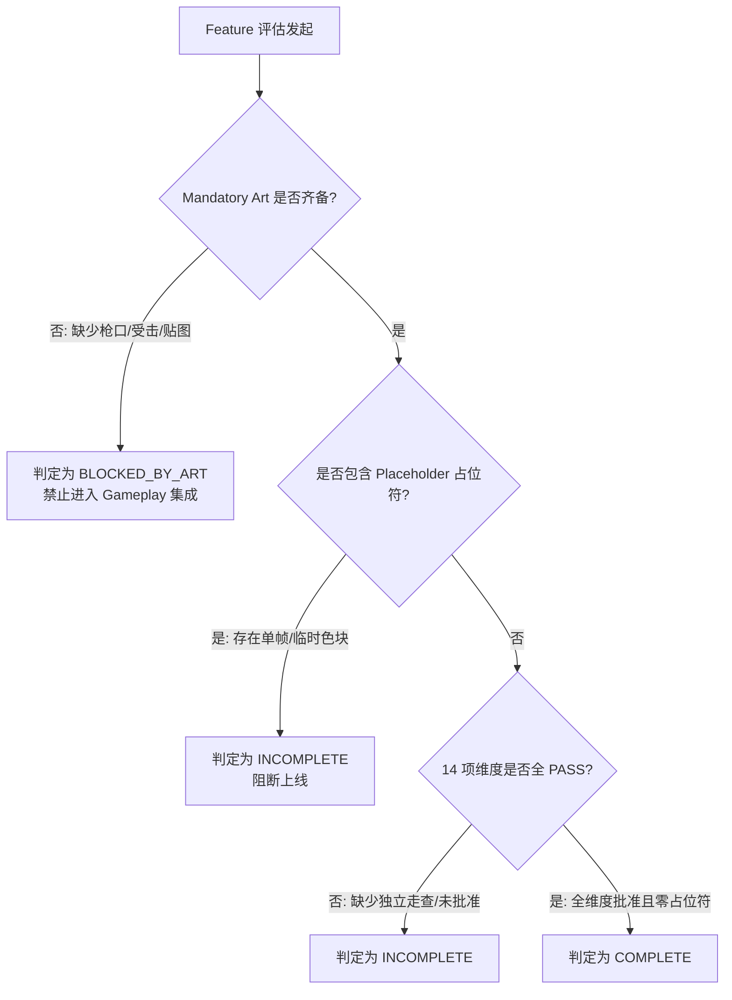

# 《GGBOM: 终末医疗兵》功能完备度多维审计报告 (Feature Completeness)

> **审计执行阶段**：Phase 0-B — Feature Completeness Takeover (Corrected)  
> **核心铁律**：  
> 1. **单纯代码存在绝不等于功能完成！**  
> 2. **任何 Mandatory Art 缺失，Feature 状态直接标记为 `BLOCKED_BY_ART`**，绝对禁止进入最终 Gameplay 集成与上线！  
> 3. 特性唯有在 **代码、美术、动画、投射物、VFX、音频、UI、集成、独立预览、功能测试、人工视觉评审、回归测试全部 PASS 且 Placeholders = 0** 时，方可判定为 **`COMPLETE`**。  
> **更新日期**：2026-09-03  

---

## 一、 主要功能特性逐项多维审计表

### 1. 玩家医疗兵角色 (`Player.Medic`)
- **SPEC**: `PASS`
- **GAMEPLAY**: `PASS`（8 向按键数学解耦，单一 Tick 流，三状态分离）
- **WEAPON_VISUAL / ART**: `APPROVED`（8 向 Idle/Run 切片已锁定）
- **ANIMATION**: `PARTIAL`（Idle/Run 4 帧连续动画通过；**Attack/Hurt/Dead 动画未在蓝图状态机中接入**）
- **PROJECTILE**: `N/A`
- **MUZZLE_VFX**: `N/A`
- **IMPACT_VFX**: `N/A`
- **AUDIO**: `CANDIDATE`（音效未挂载到踏步/受击事件）
- **UI**: `PARTIAL`（受击屏幕警报未绑定）
- **INTEGRATION**: `PASS`（与正交相机、双层地图遮挡集成完备）
- **PREVIEW**: `NOT_AVAILABLE`（尚未在 `L_Preview_Character` 中进行全动作离线走查）
- **FUNCTION_TEST**: `PASS`
- **VISUAL_REVIEW**: `PARTIAL_APPROVED`（仅 Idle/Run 批准，其余动作为 CANDIDATE）
- **PLACEHOLDERS**: `0`
- **STATUS**: **`INCOMPLETE`**（受击、攻击、死亡动作分支未在蓝图中打通）

---

### 2. 突击步枪 (`Weapon.AR01`)
- **SPEC**: `PASS`
- **GAMEPLAY**: `PASS`（按 0.18s 间隔稳定直线发射子弹）
- **WEAPON_VISUAL**: `CANDIDATE`（持枪贴图待在预览关卡走查）
- **ICON**: `CANDIDATE`（卡牌图标存在，待走查）
- **PROJECTILE_VISUAL**: `PRESENT`（`SP_Bullet_Flight` 正向直线飞行）
- **PROJECTILE_DIRECTION**: `PASS`（沿 ForwardVector 直线飞行，玩家转向不弯折）
- **PROJECTILE_SCALE**: `UNVERIFIED`（当前约为 48x48 uu，需在标尺走廊核验）
- **MUZZLE_VFX**: **`MISSING`**（**缺失独立出膛火花**）
- **IMPACT_VFX**: **`MISSING`**（**缺失击中目标爆炸粒子**）
- **AUDIO**: `UNKNOWN`
- **HUD**: `PARTIAL`（武器槽为静态 Card，未响应开火冷却与弹药减少）
- **PREVIEW**: `NOT_AVAILABLE`（无独立武器预览走查环境）
- **FUNCTION_TEST**: `PARTIAL`
- **VISUAL_REVIEW**: `NOT_REVIEWED`
- **PLACEHOLDERS**: `0`
- **STATUS**: **`BLOCKED_BY_ART`**（**Mandatory Muzzle VFX 与 Impact VFX 缺失，阻断最终集成**）

---

### 3. 霰弹枪 (`Weapon.SG01`)
- **SPEC**: `PASS`
- **GAMEPLAY**: `PARTIAL`（扇形 5 发 30° 散射算法尚未实装）
- **WEAPON_VISUAL**: `CANDIDATE`
- **ICON**: `CANDIDATE`
- **PROJECTILE_VISUAL**: `CANDIDATE`（`T_Bullet_Buckshot_02_Flight` 处于候选）
- **PROJECTILE_DIRECTION**: `UNVERIFIED`
- **PROJECTILE_SCALE**: `UNVERIFIED`
- **MUZZLE_VFX**: **`MISSING`**
- **IMPACT_VFX**: `CANDIDATE`（P01 中有候选烈焰爆炸，未挂载）
- **AUDIO**: `UNKNOWN`
- **HUD**: `PARTIAL`
- **PREVIEW**: `NOT_AVAILABLE`
- **FUNCTION_TEST**: `FAIL`
- **VISUAL_REVIEW**: `NOT_REVIEWED`
- **PLACEHOLDERS**: `1`（使用了旧版单图占位）
- **STATUS**: **`BLOCKED_BY_ART`**

---

### 4. 动能手枪 (`Weapon.KineticPistol`)
- **SPEC**: `PASS`
- **GAMEPLAY**: `PARTIAL`（点射原型可用，未组件化接入）
- **WEAPON_VISUAL**: `CANDIDATE`
- **ICON**: `CANDIDATE`
- **PROJECTILE_VISUAL**: `APPROVED`（已验证 0.25 缩放 32x32 uu 尺寸）
- **PROJECTILE_DIRECTION**: `PASS`
- **PROJECTILE_SCALE**: `PASS`
- **MUZZLE_VFX**: `CANDIDATE`（`SP_Bullet_KP_01_Muzzle` 待走查）
- **IMPACT_VFX**: `CANDIDATE`（`SP_Bullet_KP_03_Impact` 待走查）
- **AUDIO**: `UNKNOWN`
- **HUD**: `PARTIAL`
- **PREVIEW**: `NOT_AVAILABLE`
- **FUNCTION_TEST**: `PARTIAL`
- **VISUAL_REVIEW**: `NOT_REVIEWED`
- **PLACEHOLDERS**: `0`
- **STATUS**: **`INCOMPLETE`**

---

### 5. 基础行尸怪物 (`Enemy.ZombieWalker`)
- **SPEC**: `PASS`
- **GAMEPLAY**: `PARTIAL`（有基础碰撞扣血，缺少 4 向朝向与硬直逻辑）
- **ENEMY_VISUAL**: `CANDIDATE`（P01 具备完整 4 帧 Flipbook）
- **ANIMATION**: `CANDIDATE`
- **PROJECTILE**: `N/A`
- **MUZZLE_VFX**: `N/A`
- **IMPACT_VFX**: **`MISSING`**（缺少受击闪白与死亡爆浆）
- **AUDIO**: `UNKNOWN`
- **HUD**: `N/A`
- **PREVIEW**: `NOT_AVAILABLE`
- **FUNCTION_TEST**: `PARTIAL`
- **VISUAL_REVIEW**: `NOT_REVIEWED`
- **PLACEHOLDERS**: **`1`**（**场景中挂载的是单帧静态 `SP_ZombieWalker` 占位符**）
- **STATUS**: **`BLOCKED_BY_ART`**

---

### 6. 战斗 HUD 界面 (`UI.CombatHUD`)
- **SPEC**: `PASS`
- **GAMEPLAY**: `PARTIAL`（控件树就绪，数据源为空壳，无 Mock ViewModel）
- **WEAPON_VISUAL / UI_ART**: `CANDIDATE`（使用了部分临时纯色切片）
- **ANIMATION**: `N/A`
- **PROJECTILE**: `N/A`
- **MUZZLE_VFX**: `N/A`
- **IMPACT_VFX**: `N/A`
- **AUDIO**: `N/A`
- **HUD**: `PARTIAL`
- **INTEGRATION**: `PARTIAL`（屏幕空间渲染正常，已移除世界空间旧 HUD）
- **PREVIEW**: `NOT_AVAILABLE`（缺少独立 `L_Preview_UI` 离线审查）
- **FUNCTION_TEST**: `PARTIAL`
- **VISUAL_REVIEW**: `NOT_REVIEWED`
- **PLACEHOLDERS**: **`2`**（血条与经验条使用临时纯色块占位）
- **STATUS**: **`INCOMPLETE`**

---

### 7. 双层关卡环境 (`Stage.Main` / `Stage00_Start`)
- **SPEC**: `PASS`
- **GAMEPLAY**: `PASS`（正交阻挡与物理边界完整）
- **GROUND_LAYER**: `APPROVED`（底层地面贴图哈希锁定）
- **OVERHEAD_LAYER**: `APPROVED`（顶层遮挡贴图哈希锁定）
- **PROJECTILE**: `N/A`
- **VFX**: `N/A`
- **AUDIO**: `PASS`（背景环境音效）
- **UI**: `N/A`
- **INTEGRATION**: `PASS`（正交相机 941.0 满屏视野无缝嵌合）
- **PREVIEW**: `PASS`
- **FUNCTION_TEST**: `PASS`
- **VISUAL_REVIEW**: `APPROVED`
- **PLACEHOLDERS**: `0`
- **STATUS**: **`PASS`**（当前唯一全维度达成 PASS 的特性）

---

## 二、 完整性结论与生产拦截原则

