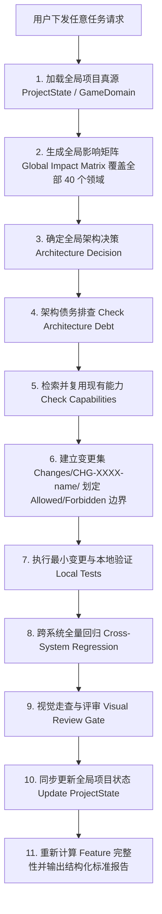

# 《GGBOM: 终末医疗兵》全局 AI 项目治理协议 (Global AI Project Governance Protocol)

> **版本**：Version 1.0 (Machine-Authoritative Standard)  
> **生效范围**：**全项目、全领域、全任务绝对强制执行，无任何例外**。  
> **核心原则**：**EVERY REQUEST IS A PROJECT CHANGE. NO REQUEST IS AN ISOLATED FILE EDIT.**

---

## 一、 核心铁律与流程概览 (The 28 Governance Rules)



---

## 二、 40 个影响领域标准清单 (The 40 Domains Matrix)

1. `PRODUCT RULES`
2. `GAME LOOP`
3. `PLAYER`
4. `ATTRIBUTES`
5. `HEALTH`
6. `DAMAGE`
7. `COMBAT`
8. `WEAPON`
9. `PROJECTILE`
10. `ABILITY`
11. `STATUS EFFECT`
12. `ENEMY`
13. `BOSS`
14. `AI`
15. `UPGRADE`
16. `PROGRESSION / XP`
17. `DROP / REWARD`
18. `ECONOMY`
19. `SCENE`
20. `ENCOUNTER`
21. `SPAWN`
22. `CAMERA`
23. `COLLISION / PHYSICS`
24. `INPUT`
25. `SAVE / LOAD`
26. `DATA / DEFINITIONS`
27. `UI`
28. `VIEWMODEL`
29. `PRESENTATION`
30. `ANIMATION`
31. `ART`
32. `VFX`
33. `AUDIO`
34. `ASSET REGISTRY`
35. `VISUAL BASELINE`
36. `PERFORMANCE`
37. `ANDROID / PLATFORM`
38. `TESTS`
39. `ARCHITECTURE`
40. `TECH DEBT`

---

## 三、 标准任务完成汇报格式模板 (Rule 24 Template)

每次任务必须以如下格式作为标准交付结构：

```text
==================================================
TASK: [简明任务描述]
ARCHITECTURE DECISION: [REUSE / CONTENT_CHANGE / SYSTEM_EXTENSION / REFACTOR_FIRST / ...]
GLOBAL IMPACT MATRIX: [40 个领域的完备状态与简要理由]
REUSED CAPABILITIES: [复用的现有能力列表]
NEW CAPABILITIES: [新增的能力与注册]
ARCHITECTURE DEBT: [债务影响与更新]
VISUAL IMPACT: [视觉资产与基线影响]
FILES / ASSETS MODIFIED: [修改的文件列表]
FORBIDDEN MODIFICATIONS: 0 / N
LOCAL TEST: [本地测试命令与输出 PASS/FAIL]
CROSS-SYSTEM REGRESSION: [跨域回归测试命令与输出 PASS/FAIL]
VISUAL REVIEW: [视觉走查结果与门禁状态]
PROJECT STATE UPDATE: [已更新的真源文件]
AFFECTED FEATURE COMPLETENESS: [影响特性的 17 维最新完备度]
REMAINING BLOCKERS: [当前阻断项清单]
FINAL RESULT: PASS / FAIL / BLOCKED
==================================================
```
