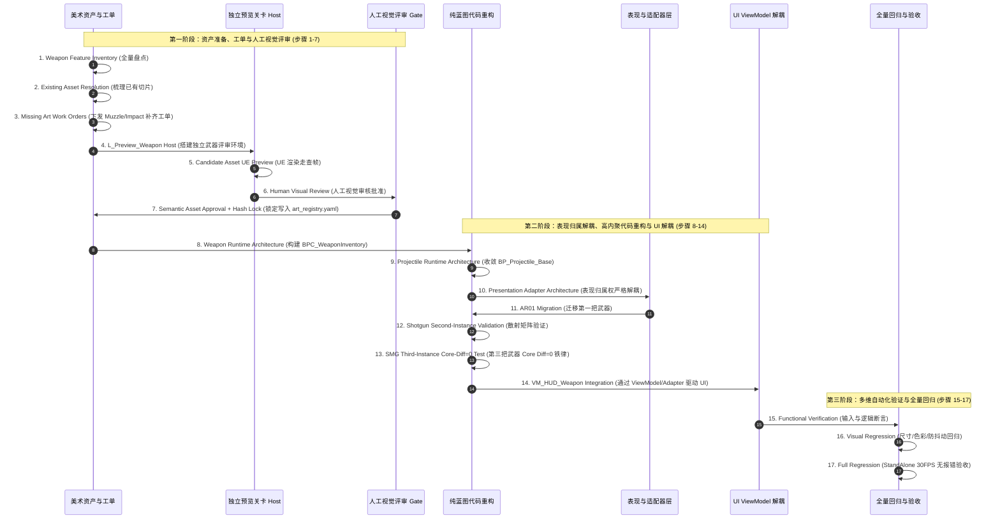

# 《GGBOM: 终末医疗兵》Phase 1 武器系统迁移与生产闭环计划 (Phase 1 Migration Plan)

> **目标版本**：Phase 1 Weapon Architecture + Visual Production Proof (Strict 17-Step Pipeline)  
> **核心原则**：**资产与 Preview 先行，代码重构在后！** 严禁将视觉审核推迟到代码实现之后；严禁单纯代码重构。  
> **制定日期**：2026-09-03  

---

## 一、 Phase 1 严格执行 17 步时序管线

---

## 二、 17 步详细工作说明

### 步骤 1：当前武器特性全量盘点 (Weapon Feature Inventory)
- 盘点 AR01、Shotgun、KineticPistol、SMG 的输入需求、开火模式（自动/散射/点射）、射速、单发弹丸数、伤害、射程与弹道形态。

### 步骤 2：梳理已有资产 (Existing Asset Resolution)
- 严格对照 `/Game/P01/Imported/Content/Asset/Art/03_Weapons` 与 `05_VFX`，清点各武器已有切片与可复用特效（如 `VFX_Spark`、`VFX_Flame`）。

### 步骤 3：下发缺失美术工单 (Missing Art Work Orders)
- 针对 AR01 与 Shotgun 缺失的专用 Muzzle VFX，下发标准化工单，补齐或正式指定复用方案，消除 `BLOCKED_BY_ART` 状态。

### 步骤 4：搭建武器独立预览环境 (L_Preview_Weapon Host)
- 建立轻量独立地图 `/Game/Preview/L_Preview_Weapon.umap`。
- 设置固定正交相机、角色 Dummy、枪口锚点、弹道标尺走廊、受击木桩 Target Dummy 与 HUD 槽位预览窗。
- 支持一键命令行执行：`python dev.py preview weapon <WEAPON_ID>`。

### 步骤 5：候选资产 UE 实机预览 (Candidate Asset UE Preview)
- 在 `L_Preview_Weapon` 中输出 6 张标准走查截图（`overview`, `hold`, `muzzle`, `flight`, `impact`, `hud`）。

### 步骤 6：人工视觉审核与批准 (Human Visual Review)
- **绝对门禁**：由用户人工审查走查截图，确认持枪位置、枪口火花位置、子弹尺寸（32~48 uu）、命中爆炸与图标无误后，正式批准晋升为 `ART_APPROVED`。

### 步骤 7：语义资产注册与哈希锁定 (Semantic Asset Approval + Hash Lock)
- 计算获批资产的 MD5 哈希，写入 [`ProjectState/art_registry.yaml`](file:///Users/cc/Desktop/GGBOM/ProjectState/art_registry.yaml)，标记 `replacement_requires_approval: true` 予以物理锁定。

---

### 步骤 8：构建武器统一运行时组件 (Weapon Runtime Architecture)
- 构建纯蓝图组件 `BPC_WeaponInventory`，负责武器槽位轮换、冷却计时器（按 `FireRate` 驱动）、射击朝向分发（快照 `ShotDirection` 并 `MakeRotFromX`）。
- 从玩家蓝图 `BP_Player_Medic` 中剥离硬编码开火。

### 步骤 9：收敛统一投射物运行时 (Projectile Runtime Architecture)
- 废弃并归档历史多余基类，统一收敛至 [`BP_Projectile_Base`](file:///Users/cc/Desktop/GGBOM/xxxx/Content/Blueprints/Projectiles/BP_Projectile_Base.uasset)。
- 规范生命周期：`BeginPlay` 读取方向/速度 ➔ `Tick` 直线/扇形位移 ➔ `OnOverlap` 触发命中并销毁。

### 步骤 10：表现归属权严格解耦 (Presentation Adapter Architecture)
- **职责铁律**：
  - **Weapon Runtime** ➔ 发送 `WeaponFired` 语义事件 ➔ **Weapon Presentation** 负责实例化枪口火花 (`Muzzle VFX`) 与开火音效。
  - **Projectile Runtime** ➔ 发送 `ProjectileHit` 语义事件 ➔ **Projectile Presentation** 负责在碰撞点实例化命中爆炸 (`Impact VFX`) 与受击音效。
  - 严禁 `BP_Projectile_Base` 跨职责管理枪口火花！

### 步骤 11：第一把武器迁移 (AR01 Migration)
- 配置 `Weapon.AR01` 数据结构（0.18s 射速，直线单发），绑定已获批的语义资产。

### 步骤 12：第二把武器与散射算法验证 (Shotgun Second-Instance Validation)
- 配置 `Weapon.SG01` 数据结构（0.75s 射速，单发 5 弹丸，30° 扩散角）。
- 验证数学偏转矩阵在投射物生成时的扇形偏转正确性。

### 步骤 13：第三把武器 Core Diff = 0 架构测试 (SMG Third-Instance Test)
- 接入第三把武器（SMG）。
- **铁律指标**：底层通用蓝图（`BP_Projectile_Base`, `BPC_WeaponInventory`）修改行数必须为 0，纯靠配置数据与资产绑定接入。

---

### 步骤 14：UI 与 ViewModel 解耦集成 (VM_HUD_Weapon Integration)
- **UI 架构规范**：
  - `BPC_WeaponInventory` ➔ 发布武器状态与事件 ➔ **`VM_HUD_Weapon` / Presentation Adapter** ➔ 驱动 [`WBP_HUD_WeaponSlot`](file:///Users/cc/Desktop/GGBOM/xxxx/Content/GGBOM/UI/WBP_HUD_WeaponSlot.uasset)。
  - **严禁 Widget 直接 Cast Player、访问 WeaponComponent 或直接修改 Ammo**。
  - 动态驱动 [`SP_HUD_AmmoRadial`](file:///Users/cc/Desktop/GGBOM/xxxx/Content/GGBOM/Art/Sprites/SP_HUD_AmmoRadial.uasset) 顺时针冷却微动画。

### 步骤 15：功能性自动化验证 (Functional Verification)
- 运行断言测试，验证开火、冷却、伤害结算、换弹、按键解耦与方向锁定。

### 步骤 16：视觉回归与防抖动测试 (Visual Regression)
- 验证 2D 像素色彩保真（Clamp/NoMipmaps/sRGB）、无白边、无子像素抖动、子弹尺寸符合 32~48 uu 基线。

### 步骤 17：全量实机运行验收 (Full Regression)
- 在 StandAlone 360x640 @ 30FPS 独立游戏窗口中运行主关卡 [`MAP_GGBOM_Main`](file:///Users/cc/Desktop/GGBOM/xxxx/Content/GGBOM/Maps/MAP_GGBOM_Main.umap)，确认无蓝图运行时报错（`Errors = 0, Accessed None = 0`），宣告 Phase 1 圆满完成。
