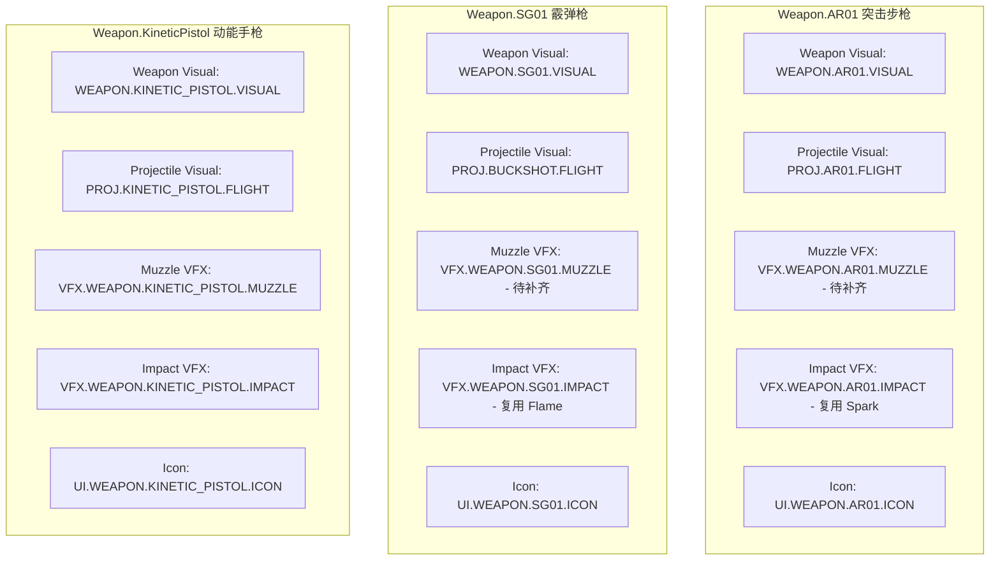

# 《GGBOM: 终末医疗兵》全量武器特性清单与依赖解析报告 (Weapon Feature Inventory)

> **版本**：Phase 1A Weapon Inventory Specification  
> **制定原则**：系统化盘点 10 种武器特性，明确 Gameplay 参数、开火模式、弹道类型及全量 Presentation 表现依赖。  
> **制定日期**：2026-09-03  

---

## 一、 10 种武器全量特性矩阵 (10 Weapon Archetype Matrix)

| 武器标识 | 武器名称 | 开火模式 (FirePolicy) | 散射策略 (SpreadPolicy) | 射击间隔 (FireRate) | 单发弹丸 (Pellets) | 扩散角 (Spread) | 弹速 (uu/s) | 基础伤害 | 弹道行为 |
| :--- | :--- | :--- | :--- | :--- | :--- | :--- | :--- | :--- | :--- |
| **`Weapon.AR01`** | AR-01 突击步枪 | `Automatic` | `Single` | `0.18s` | 1 | 0° | 600.0 | 25.0 | 高速直线 |
| **`Weapon.SG01`** | SG-01 重型霰弹枪 | `SemiAuto` | `ConeSpread` | `0.75s` | 5 | 30° (±15°) | 550.0 | 18.0 × 5 | 扇形散射 |
| **`Weapon.KineticPistol`**| 动能战术手枪 | `SemiAuto` | `Single` | `0.35s` | 1 | 0° | 700.0 | 35.0 | 高精点射 |
| **`Weapon.SMG`** | 冲锋枪 | `Automatic` | `Pattern` | `0.10s` | 1 | 6° (微抖动) | 650.0 | 16.0 | 极速扫射 |
| **`Weapon.LaserRail`** | 激光磁轨枪 | `Charge` | `Single` | `1.20s` | 1 | 0° | 1500.0 | 90.0 | 穿透直线 |
| **`Weapon.FlameThrower`**| 烈焰喷射器 | `Continuous` | `Radial` | `0.06s` | 1 | 45° | 350.0 | 8.0 (持续) | 短程范围 |
| **`Weapon.CryoCannon`** | 低温急冻炮 | `Burst` | `Single` | `0.80s` | 3 | 4° | 500.0 | 30.0 | 减速冻结 |
| **`Weapon.PlasmaArc`** | 等离子弧光枪 | `SemiAuto` | `Single` | `0.50s` | 1 | 0° | 450.0 | 45.0 | 范围溅射 |
| **`Weapon.TeslaCoil`** | 特斯拉电弧枪 | `SemiAuto` | `ChainHoming` | `0.60s` | 1 | 0° | 800.0 | 40.0 | 连锁闪电 |
| **`Weapon.Rocket`** | 微型导弹发射器 | `SemiAuto` | `Single` | `1.00s` | 1 | 0° | 400.0 | 120.0 | 范围爆炸 |

---

## 二、 Phase 1 目标验证集全量依赖解析 (Target Proof Set Resolution)

### 1. `Weapon.AR01` (突击步枪)
- **Weapon Visual**: [`/Game/P01/Imported/Content/Asset/Art/03_Weapons/02_AssaultRifle/T_Wpn_AutoRifle.uasset`](file:///Users/cc/Desktop/GGBOM/xxxx/Content/P01/Imported/Content/Asset/Art/03_Weapons/02_AssaultRifle/T_Wpn_AutoRifle.uasset)
- **Projectile Visual**: [`/Game/GGBOM/Art/Sprites/SP_Bullet_Flight.uasset`](file:///Users/cc/Desktop/GGBOM/xxxx/Content/GGBOM/Art/Sprites/SP_Bullet_Flight.uasset)
- **Muzzle VFX**: `MISSING`（下发 `WO-ART-001` 工单补齐专用出膛火花）
- **Impact VFX**: 采用 `/Game/P01/Imported/Content/Asset/Art/05_VFX/14_Spark` 机械火花
- **Icon**: [`/Game/GGBOM/Art/Sprites/SP_Card_AutoRifle.uasset`](file:///Users/cc/Desktop/GGBOM/xxxx/Content/GGBOM/Art/Sprites/SP_Card_AutoRifle.uasset)

### 2. `Weapon.SG01` (霰弹枪)
- **Weapon Visual**: [`/Game/P01/Imported/Content/Asset/Art/03_Weapons/03_Shotgun/T_Wpn_Shotgun.uasset`](file:///Users/cc/Desktop/GGBOM/xxxx/Content/P01/Imported/Content/Asset/Art/03_Weapons/03_Shotgun/T_Wpn_Shotgun.uasset)
- **Projectile Visual**: [`/Game/P01/Imported/Content/Asset/Art/03_Weapons/03_Shotgun/T_Bullet_Buckshot_02_Flight.uasset`](file:///Users/cc/Desktop/GGBOM/xxxx/Content/P01/Imported/Content/Asset/Art/03_Weapons/03_Shotgun/T_Bullet_Buckshot_02_Flight.uasset)
- **Muzzle VFX**: `MISSING`（下发 `WO-ART-002` 工单补齐扇形 5 弹丸出膛火花）
- **Impact VFX**: 采用 `/Game/P01/Imported/Content/Asset/Art/05_VFX/01_Flame` 烈焰爆炸
- **Icon**: [`/Game/GGBOM/Art/Sprites/SP_Card_Shotgun.uasset`](file:///Users/cc/Desktop/GGBOM/xxxx/Content/GGBOM/Art/Sprites/SP_Card_Shotgun.uasset)

### 3. `Weapon.KineticPistol` (动能手枪 — 标准样板)
- **Weapon Visual**: [`/Game/P01/Imported/Content/Asset/Art/03_Weapons/01_KineticPistol/T_Bullet_KineticPistol_01_Muzzle.uasset`](file:///Users/cc/Desktop/GGBOM/xxxx/Content/P01/Imported/Content/Asset/Art/03_Weapons/01_KineticPistol/T_Bullet_KineticPistol_01_Muzzle.uasset)
- **Projectile Visual**: [`/Game/GGBOM/Art/Sprites/Weapons/SP_Bullet_KP_02_Flight.uasset`](file:///Users/cc/Desktop/GGBOM/xxxx/Content/GGBOM/Art/Sprites/Weapons/SP_Bullet_KP_02_Flight.uasset)
- **Muzzle VFX**: [`/Game/GGBOM/Art/Sprites/Weapons/SP_Bullet_KP_01_Muzzle.uasset`](file:///Users/cc/Desktop/GGBOM/xxxx/Content/GGBOM/Art/Sprites/Weapons/SP_Bullet_KP_01_Muzzle.uasset)
- **Impact VFX**: [`/Game/GGBOM/Art/Sprites/Weapons/SP_Bullet_KP_03_Impact.uasset`](file:///Users/cc/Desktop/GGBOM/xxxx/Content/GGBOM/Art/Sprites/Weapons/SP_Bullet_KP_03_Impact.uasset)
- **Icon**: [`/Game/GGBOM/Art/Sprites/SP_Wpn_AutoRifle.uasset`](file:///Users/cc/Desktop/GGBOM/xxxx/Content/GGBOM/Art/Sprites/SP_Wpn_AutoRifle.uasset)
