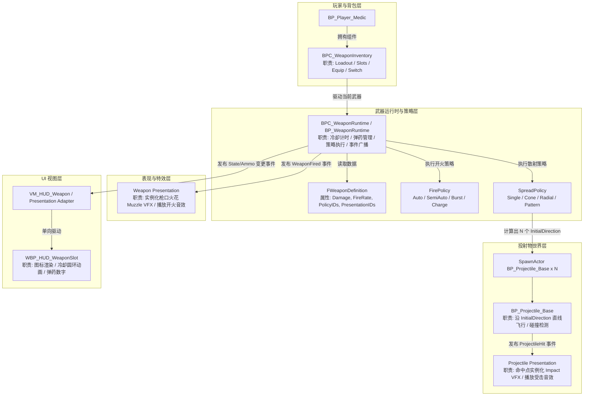

# 《GGBOM: 终末医疗兵》武器系统运行时架构契约规范 (Weapon Runtime Contract)

> **契约版本**：Phase 0-C Canonical Weapon Architecture Specification  
> **适用范围**：UE5.8 纯蓝图武器与投射物系统  
> **设计目标**：**高内聚、低耦合、数据策略驱动、职责清晰划分**。坚决防止组件超级膨胀，严禁蓝图硬编码资产路径与武器特异分支。  
> **制定日期**：2026-09-03  

---

## 一、 武器系统职责分工与拓扑架构

---

## 二、 核心组件与数据结构职责细则

### 1. 武器库存组件 (`BPC_WeaponInventory`) — **严禁超级组件化**
- **唯一职责**：
  1. 管理玩家拥有的武器槽位列表（`WeaponSlots[0..2]`）；
  2. 管理当前激活槽位索引（`ActiveSlotIndex`）；
  3. 响应切枪输入（数字键 1/2/3 或滚轮），执行 `EquipWeapon(Slot)` 与 `SwitchWeapon()`；
  4. 持有当前武器运行时的引用，并转发开火触发输入（`OnFirePressed / OnFireReleased`）。
- **绝对禁令**：
  - **严禁管理开火冷却计时器**（移入 WeaponRuntime）；
  - **严禁直接管理子弹生成与散射数学计算**（移入 SpreadPolicy）；
  - **严禁直接修改 UI Widget**。

---

### 2. 武器运行时 (`BPC_WeaponRuntime / BP_WeaponRuntime`)
- **唯一职责**：
  1. 维护当前装备武器的实时运行状态（开火冷却计时器、弹匣剩余弹药数、换弹状态）；
  2. 根据 `FWeaponDefinition` 中配置的 `FirePolicy` 和 `SpreadPolicy` 执行发射流；
  3. **发布语义化事件 (Semantic Events)**：
     - `OnWeaponFired(MuzzleLocation, FireDirection, WeaponID)`
     - `OnAmmoChanged(CurrentAmmo, MaxAmmo)`
     - `OnReloadStarted()` / `OnReloadFinished()`
     - `OnWeaponEquipped(WeaponDef)`

---

### 3. 霰弹枪散射契约规范 (Shotgun Contract)
- **核心原则**：**散射（Spread）属于武器生成行为，绝不属于子弹飞行行为！**
- **执行时序**：
  1. 玩家触发开火 ➔ `WeaponRuntime` 触发 `SpreadPolicy`（`ConeSpreadPolicy`）；
  2. `SpreadPolicy` 读取配置参数：`PelletCount = 5`, `SpreadAngle = 30°`；
  3. 以武器瞄准朝向为基准，数学计算出 5 个独立的发射向量：
     $$\vec{D}_i = \text{Rotate}(\vec{D}_{\text{base}}, \Delta \theta_i), \quad \Delta \theta_i \in [-15^\circ, -7.5^\circ, 0^\circ, +7.5^\circ, +15^\circ]$$
  4. 循环调用 5 次 `SpawnActor(BP_Projectile_Base)`，向每个实例分别传入其对应的 `InitialDirection`、`Speed`、`Damage`；
  5. **普通子弹 `BP_Projectile_Base` 完全通用**：其内部只读取给定的初始方向直线飞行并做碰撞检测，**内部严禁出现 `if Shotgun` 或武器特异分支**！

---

### 4. 表现归属权职责解耦 (Presentation Ownership)

| 表现元素 | 权威所有者 | 触发时机与生成位置 | 销毁/回收规则 |
| :--- | :--- | :--- | :--- |
| **枪口出膛火花 (`Muzzle VFX`)** | **Weapon Presentation** | `OnWeaponFired` 触发时，在枪口锚点 (`Z+55, Y-5`) 实例化 | 播放 1 个周期（约 0.08s）后自动销毁 |
| **开火音频 (`Fire Audio`)** | **Weapon Presentation** | `OnWeaponFired` 触发时播放 | 音效播放完毕自动结束 |
| **飞行弹道 (`Flight Visual`)** | **Projectile Instance** | 子弹生成后自身挂载的 Flipbook / Sprite | 随子弹销毁而销毁 |
| **命中爆炸 (`Impact VFX`)** | **Projectile Presentation** | `OnProjectileHit` 命中目标时，在碰撞世界坐标实例化 | 播放 1 个周期（约 0.15s）后自动销毁 |
| **命中音频 (`Impact Audio`)** | **Projectile Presentation** | `OnProjectileHit` 命中目标时在碰撞点播放 | 音效播放完毕自动结束 |

---

### 5. UI 交互与解耦契约 (UI Decoupling Contract)
- **严禁 UI 侵入 Gameplay**：
  - `WBP_HUD_WeaponSlot` 严禁 `Cast<BP_Player_Medic>`；
  - 严禁 Widget 直接持有 `BPC_WeaponInventory` 或直接修改 `Ammo` 变量；
  - 严禁 Widget 越权调用开火或换弹逻辑。
- **规范数据流**：
  - 建立中间适配器/ViewModel（`VM_HUD_Weapon`）；
  - `WeaponRuntime` 发出 `OnAmmoChanged` ➔ `VM_HUD_Weapon` 格式化数据 ➔ 驱动 `WBP_HUD_WeaponSlot` 更新卡牌图标、文本并触发冷却圆环材质动画。
